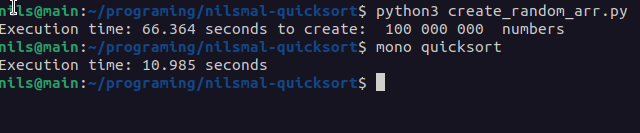

# nilsmal-quicksort
quicksort go speeeeeeeeeeeeeed (also brrrr)

Python <3 

Generating numbers in python is 7x slower than sorting them in C# 

Python <3<3<3<3<3<33<3<3<3<<3<3<3<3

The file named quicksort_kattis.cs is the file with the actual code ran on kattis. The other files are for testing. 
The quicksortfile.cs handles another input type which is generated from create_random_arr.py. 

